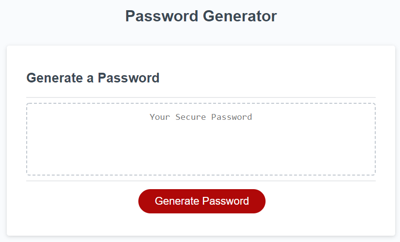

# HW3-Random-password-Generator
There are only 5 variables (length, lowercase, UPPERCASE, numbers, special characters)

## Introduction
Provided with starting html and css file, javascript is edited to satisfy the acceptance criteria detailed below. 
Note that the password satisfy the some optional preferences provided by the user.

## Acceptance Criteria

GIVEN I need a new, secure password
WHEN I click the button to generate a password
THEN I am presented with a series of prompts for password criteria
WHEN prompted for password criteria
THEN I select which criteria to include in the password
WHEN prompted for the length of the password
THEN I choose a length of at least 8 characters and no more than 128 characters
WHEN asked for character types to include in the password
THEN I confirm whether or not to include lowercase, uppercase, numeric, and/or special characters
WHEN I answer each prompt
THEN my input should be validated and at least one character type should be selected
WHEN all prompts are answered
THEN a password is generated that matches the selected criteria
WHEN the password is generated
THEN the password is either displayed in an alert or written to the page

## Transcripted options

Length, lowercase, UPPERCASE, numbers, special characters

## Sources

[list of password special characters](https://www.owasp.org/index.php/Password_special_characters)

## Screenshot

## Links

[Open Password Generator Code](https://github.com/Hongnodie/HW3-Random-password-Generator.git) 

[Live Website](https://hongnodie.github.io/HW3-Random-password-Generator/Develop/index.html)  

[My Github Account](https://github.com/Hongnodie)